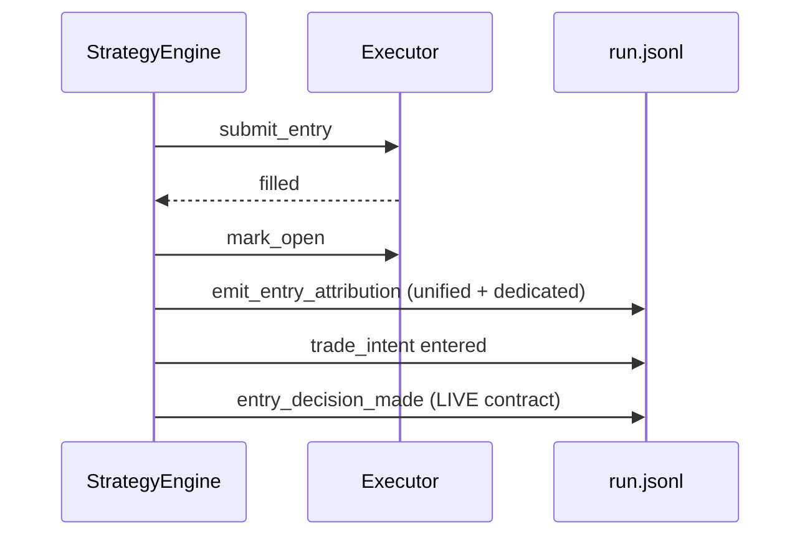

# Alpaca entry decision truth map

**UTC:** 2026-03-28T03:57:50Z

## Decision moment (filled immediate entry)

Primary path: `StrategyEngine.decide_and_execute` → order `submit_entry` → `entry_status == "filled"` → `executor.mark_open` → `emit_entry_attribution` → `_emit_trade_intent(... entered ...)` → **`emit_entry_decision_made(jsonl_write, ...)`**.

### Code references

| Step | Location |
|------|----------|
| Gate + `entered_intelligence_trace` | `main.py` ~9985–10058 (`build_initial_trace`, directional gate) |
| Fill handling + `mark_open` | `main.py` ~10238–10298 |
| Unified + dedicated entry economics | `main.py` ~10299–10349 (`emit_entry_attribution`) |
| `trade_intent` entered | `main.py` ~10360–10405 (`_emit_trade_intent`) |
| **`entry_decision_made`** | `main.py` ~10406–10433 (`telemetry.alpaca_entry_decision_made_emit.emit_entry_decision_made`) |
| Emitter implementation | `telemetry/alpaca_entry_decision_made_emit.py` |
| Dedicated / unified entry schema | `src/telemetry/alpaca_attribution_emitter.py` (`emit_entry_attribution`) |

## Data at decision time

- **Score / components:** `score`, `comps`, `c["composite_meta"]` (components, component_contributions) — same objects as order submission.
- **Policy anchor:** derived from `composite_meta` / cluster (`policy_id`, `strategy_id`, …) → default `alpaca_equity_default`.
- **Intelligence trace:** `entered_intelligence_trace` when gate path succeeds; may be absent on telemetry errors (blocker or components-only fallback).
- **Join keys:** `canonical_trade_id` from position metadata after `mark_open`; `trade_id_open` = `open_<SYM>_<entry_ts>`.

## Why `trade_intent_entered_non_synthetic_count == 0` was observed (historical)

On hosts where **only** `strict_backfill_run.jsonl` contained entered `trade_intent` rows (synthetic repairs), every row carried `strict_backfilled` / `strict_backfill_trade_id`, so non-synthetic count was zero. Live runtime rows now set `entry_intent_synthetic: false` and `entry_intent_source: live_runtime` on entered `trade_intent`, and emit `entry_decision_made` for the same fills.

## Sequence (minimal)

